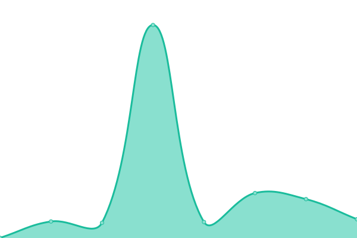
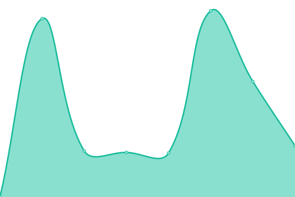

# [📈 Live Status](https://status.factoryplus.in): <!--live status--> **🟧 Partial outage**

This repository contains the open-source uptime monitor and status page for [FactoryPlus](https://status.factoryplus.in)

<!--start: status pages-->
<!-- This summary is generated by Upptime (https://github.com/upptime/upptime) -->
<!-- Do not edit this manually, your changes will be overwritten -->
<!-- prettier-ignore -->
| URL | Status | History | Response Time | Uptime |
| --- | ------ | ------- | ------------- | ------ |
|  [FactoryPlus landing](https://factoryplus.in) | 🟩 Up | [factory-plus-landing.yml](https://github.com/factoryplus/status/commits/HEAD/history/factory-plus-landing.yml) | 

 171ms
     
 | 

<a href="https://status.factoryplus.in/history/factory-plus-landing">100.00%</a>
    

|  [FactoryPlus Web App](https://web.factoryplus.in) | 🟥 Down | [factory-plus-web-app.yml](https://github.com/factoryplus/status/commits/HEAD/history/factory-plus-web-app.yml) | 

 723ms
     
 | 

<a href="https://status.factoryplus.in/history/factory-plus-web-app">99.93%</a>
    

|  [FactoryPlus API](https://api.factoryplus.in) | 🟩 Up | [factory-plus-api.yml](https://github.com/factoryplus/status/commits/HEAD/history/factory-plus-api.yml) | 

 738ms
     
 | 

<a href="https://status.factoryplus.in/history/factory-plus-api">99.86%</a>
    

<!--end: status pages-->

[**Visit our status website →**](https://status.factoryplus.in)
